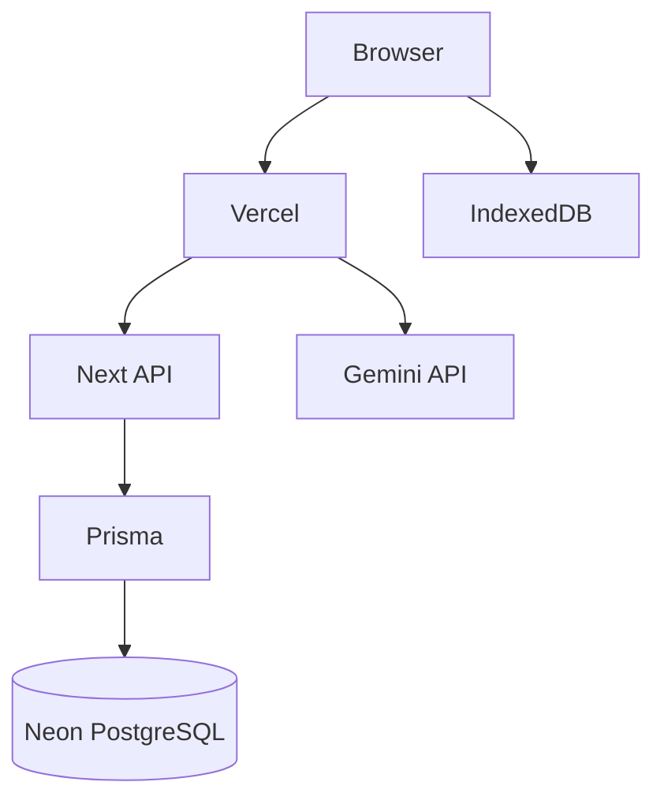

#ectly to the server.

Everything flows through local storage.

---

# Layered Architecture

```
┌───────────────────────────┐
│ React Components          │
├───────────────────────────┤
│ Feature Hooks             │
├───────────────────────────┤
│ Services                  │
├───────────────────────────┤
│ Local Repository          │
├───────────────────────────┤
│ Sync Engine              │
├───────────────────────────┤
│ API Client               │
├───────────────────────────┤
│ Server                   │
├───────────────────────────┤
│ Prisma                   │
├───────────────────────────┤
│ PostgreSQL               │
└───────────────────────────┘
`mponents/

        hooks/

        services/

        validation/

        types/

    editor/

        components/

        hooks/

        services/

        commands/

        extensions/

        types/

    documents/

    sync/

    ai/

    versions/

    permissions/
```

Every feature is isolated.

No cross-feature imports unless through services.

---

# App Folder

```
app/

    (auth)/

    dashboard/

    editor/

    api/

    layout.tsx

    providers.tsx
```

---

# Shared Folder

```
components/

hooks/

lib/

types/

constants/

validation/

db/

sync/

utils/
```

---

# Local First Data Flow

```
User Types

↓

Tiptap

↓

Editor Service

↓

Dexie Repository

↓

Inn to user
```

Notice

No network request.

Typing never waits.

---

# Synchronization Flow

```
Connection Restored

↓

Sync Worker Starts

↓

Read Pending Queue

↓

Batch Operations

↓

POST /sync

↓

Validate

↓

Apply

↓

ACK

↓

Remove Synced Operations

↓

Pull Remote Operations

↓

Apply Merge

↓

Update Local Store

↓

Render UI
```

---

# Offline Editing Flow

```
Internet Lost

↓

Application Detects Offline

↓

Continue Editing

↓

Operations Stored

↓

Queue Grows

↓

User Refreshes Browser

↓

IndexedDB Restores State

↓

Editing Continues
```

No data loss.

---

# Reconnect Flow

```
Internet Returns

↓

Queue Replay

↓

Server Validation

↓

Conflict Resolution

↓

Merge

↓

ACK

↓ycle

```

Create

↓

Edit

↓

Snapshot

↓

Offline

↓

Online

↓

Merge

↓

Snapshot

↓

Delete

```

Deletion is soft delete.

Never hard delete immediately.

---

# Component Tree

```

RootLayout

    AuthProvider

        ThemeProvider

            DashboardLayout

                Sidebar

                Topbar

                EditorPage

                    DocumentToolbar

                    Editor

                    VersionTimeline

                    AIPanel

                    SyncStatus

                    ConnectionBadge

```

---

# State Ownership

Authentication

↓

React Context

Documents

↓

Dexie

Editor

↓

Tiptap

Pending Queue

↓

Dexie

Connection

↓

React Context

Theme
    rship.

Every piece of state has one owner.

---

# Repository Pattern

Never access IndexedDB directly.

Instead

```

DocumentRepository

VersionRepository

OperationRepository

QueueRepository

```

Every repository exposes

```

create()

update()

delete()

find()

findById()

watch()

```

---

# Services

Services contain business logic.

Example

```

DocumentService

VersionService

SyncService

PermissionService

AIService

```

Services never render UI.

---

# Hooks

Hooks connect UI to services.

Example

```

useDocument()

useOffline()

useSync()

useVersions()

usePermissions()

useConnection()

useQueue()

```

Hooks never contain business logic.

---  der

↓

Request Sender

↓

Conflict Resolver

↓

Merge Engine
```

Each module is replaceable.

---

# Queue Manager

Responsible for

Adding operations

Removing operations

Retry scheduling

Duplicate detection

Persistence

Queue ordering

---

# Batch Builder

Converts

100 operations

↓

10 operations

↓

1 request

Reduces API calls.

---

# Conflict Resolver

Receives

Local operations

-

Remote operations

Produces

Merged operations

Never modifies original operations.

---

# Merge Engine

Applies merged operations

↓

Updates IndexedDB

↓

Updates React

↓

Triggers render

---

# AI Flow

```
User Selects Text

↓

AI Panel

↓

POST /api/ai

↓

Gemini

↓   ys confirms.

---

# Version History

```

Document

↓

Snapshot

↓

Version Table

↓

Timeline

↓

Preview

↓

Restore

↓

New Version

```

History remains immutable.

---

# API Layer

React never talks to Prisma.

Instead

```

React

↓

Route Handler

↓

Validation

↓

Service

↓

Repository

↓

Prisma

↓

Database

```

---

# Validation Layer

Every request

↓

Zod

↓

Business Rules

↓

Authorization

↓

Database

Reject invalid data immediately.

---

# Error Handling

```

Validation Error

↓

400

Authorization

↓

403

Authentication

↓

401

Conflict

↓

409

Unexpected

↓

500

```

No stack traces sent to client.

---

# Connection Monitoring

Browser Events

```

online

offline

```ffline

Syncing

Retrying

Conflict
```

Shown in UI.

---

# Background Worker

Responsibilities

Watch queue

Watch connection

Retry failed sync

Exponential backoff

Process batches

Idle scheduling

Never block rendering.

---

# Security Pipeline

Incoming Request

↓

Authentication

↓

Authorization

↓

Zod Validation

↓

Payload Size Check

↓

Rate Limit

↓

Business Rules

↓

Database

Never bypass this order.

---

# Deployment Architecture



---

# Folder Structure

```
app/

features/

components/

hooks/

lib/

sync/

db/

workers/

validation/
        Future Improvements

These are intentionally excluded from MVP.

WebSockets

CRDT

Yjs

Presence

Cursor tracking

Comment threads

Folder hierarchy

Shared links

Notifications

Organization support

Audit logs

Encryption at rest

---

# Definition of Good Architecture

A new engineer should be able to understand any feature within five minutes.

No feature should require knowledge of another feature's internal implementation.
         ithout rendering React.

Business logic should be testable without a browser.

React should be responsible only for presentation.
Replacing IndexedDB with another storage engine should only affect repositories.

Replacing PostgreSQL should only affect Prisma.

Replacing Gemini should only affect AIService.

Replacing Tiptap should only affect the editor feature.

Every subsystem should be independently testable.

The synchronization engine should be testable w
prisma/

public/

types/

tests/
```

---

#

Plus

Heartbeat every 30 seconds.

Connection state

```
Online

O

Result

↓

Insert Back Into Editor
```

AI never modifies document automatically.

User alwa

# Synchronization Engine

The sync engine contains five modules.

```
Queue Manager

↓

Batch Buil
↓

Context

Server

↓

TanStack Query

Never duplicate owne

Queue Cleared

↓

Sync Complete
```

---

# Document LifecdexedDB

↓

React updates immediately

↓

Operation added to Queue

↓

Retur``

Every layer has one responsibility.

---

# Feature Architecture

````
features/

    auth/

        co SyncPad Architecture

Version 1.0

---

# Philosophy

The application is designed using **Local-First Architecture**.

The browser owns the user's work.

The server owns collaboration.

The synchronization engine connects both worlds.

The UI should never directly communicate with PostgreSQL.

The UI communicates only with local repositories.

The synchronization layer is responsible for eventual consistency.

---

# High Level Architecture

```mermaid
graph LR

A[User]

A --> B[React UI]

B --> C[Editor State]

C --> D[Dexie Repository]

D --> E[IndexedDB]

D --> F[Sync Queue]

F --> G[Background Sync Engine]

G --> H[API Routes]

H --> I[Prisma]

I --> J[(PostgreSQL)]

J --> H

H --> G

G --> D

D --> C

C --> B
````

Notice:

The UI never talks dir
